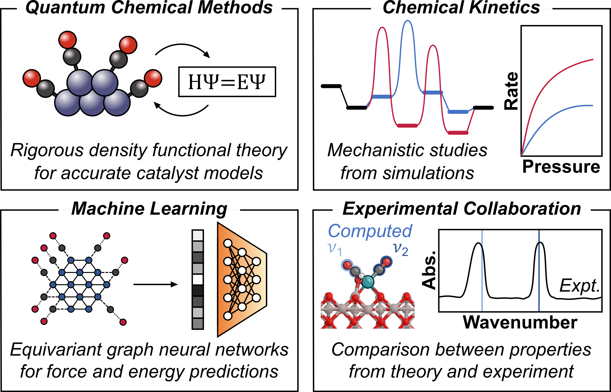

# My Background

My name is Alexander Hoffman. I'm a chemical engineer with expertise in computational heterogeneous catalysis, chemical kinetics, and machine learning. I earned my BS in Chemistry from the College of William and Mary in 2015, after which I worked at the EPA for a year. I realized that I wouldn't be able to make it far without a graduate degree, so I moved to Gainesville, FL to attend the University of Florida. Initially, I intended only to get a MS in chemical engineering; however, I started doing research with [Prof. David Hibbitts](https://hibbitts.rc.ufl.edu/) and enjoyed it so much that I stayed for 4 more years than I had planned, earning my Ph.D. under his guidance in 2022. During my Ph.D., I worked on a variety of projects with many excellent experimental groups, namely the [Gounder group at Purdue University](https://sites.google.com/site/rgounder/), the [Schwartz group at University of Maine](https://thomasschwartz.wixsite.com/schwartzgroup), and the [Christopher group at UCSB](https://www.christophergroup.engineering.ucsb.edu/). After my Ph.D., I moved to Cambridge, MA to do postdoctoral research with [Prof. Rafa G&oacute;mez-Bombarelli](http://gomezbombarelli.mit.edu/). At MIT, I've been lucky to work with [Prof. Yuriy Rom&aacute;n-Leshkov's group](https://www.romangroup.mit.edu/) and Dr. Manuel Moliner at [ITQ in Valencia](https://itq.upv-csic.es/en) to study zeolite synthesis.

When I'm not doing research, I enjoy cooking, playing sports&mdash;tennis, running, basketball, and swimming&mdash;watching classic films, reading, listening to music, and spending time with my wife, Becca, and dog, Bella.

# My Past Research 

I am always excited to discuss my work with others. Please feel free to email me about any of the papers if you cannot access them at the links below.

## University of Florida

### Br&oslash;nsted Acid Zeolite Catalysts for Alcohol Dehydration

Much of my work during my Ph.D. focused on acid strength and alcohol dehydration chemistry in Br&oslash;nsted acid-form zeolites. I used purely theoretical metrics like deprotonation energy (DPE) and experimentally measurable values like ammonia binding energies to assess [how two nearby Br&oslash;nsted acid sites interact in CHA zeolites](http://pubs.acs.org/doi/10.1021/acscatal.8b02049) and [how sites on the surfaces of zeolites differ from those in the bulk in MFI](https://pubs.acs.org/doi/10.1021/acscatal.3c00076). I also studied [methanol and ethanol dehydration reactions on pairs of nearby Br&oslash;nsted acid sites](https://onlinelibrary.wiley.com/doi/10.1002/anie.202007790), where I found that nearby coadsorbed species can for hydrogen bonds with sites where reactions occur, and [studied the effects of molecular clustering on methanol dehydration on single sites in CHA](https://linkinghub.elsevier.com/retrieve/pii/S0021951719305111). These studies of methanol and ethanol dehydration were done in collaboration with Raj Gounder's group. I also worked with a master's student in the Hibbitts group, Tsung-wei Liu, and the Schwartz group to study [hydroxymethyl furfural and ethanol cross-etherification in BEA zeolites](https://pubs.acs.org/doi/10.1021/acscatal.0c01328). I was also momentarily preoccupied by [issues with the default structure of MFI from the IZA database and how it can misbehave during some calculations](http://pubs.acs.org/doi/10.1021/acs.jpcc.8b12230). This paper (my first first-author paper) taught me the importance of using the right models for calculations in VASP!

### Supported Rh Catalysts for Pollution Abatement

My second major project during my Ph.D. was on Rh catalysts for NOx reduction. I worked with the Christopher group at UCSB to characterize [Rh nanoparticles](https://pubs.acs.org/doi/10.1021/acs.jpcc.1c05160) and [single-atoms](https://pubs.acs.org/doi/10.1021/acscatal.2c02813) on &gamma;-Al2O3 supports. Rh can be particularly frustrating to work with because it reversibly aggregates to nanoparticles and disperses to single-atoms on oxide supports; as such, the active sites for NOx reduction can change over the course of the reaction. These projects sparked my interest in single-atom metal catalysts and the promise they provide for maximizing precious metal use and tailoring the behavior of active sites. 

## MIT

### Controlling Zeolite synthesis

I did some work studying zeolite synthesis during my Ph.D. in collaboration with the Gounder group&mdash;in particular, analyzing the way that [Al is substituted near one another in MFI and which of those pairs are titrated by Co2+](https://pubs.acs.org/doi/10.1021/acs.chemmater.0c03154) and [how tetrabutyl ammonium and tetrapropyl ammonium co-occlude with Na+ during MEL and MFI synthesis](https://pubs.acs.org/doi/10.1021/acs.chemmater.2c01083). However, my work during my Ph.D. used exclusively density functional theory (DFT) to characterize materials and study reaction mechanisms, but these tools can only model relatively small systems, relatively short time-scales, and are generally too slow to rapidly screen the full materials space that heterogeneous catalysts occupy. Therefore, I moved to MIT to work with Rafa G&oacute;mez-Bombarelli to learn more about machine learning (ML) methods as they pertain to zeolite synthesis and other computational chemistry challenges. We have submitted two manuscripts related to my postdoctoral work: one describing an approach to [learn new descriptors to predict zeolite synthesis outcomes](https://chemrxiv.org/engage/chemrxiv/article-details/66fae4c251558a15ef9d20db) and another [exploring the synthesis space of OSDAs for known zeolites to find cheaper synthesis routes for new compositions](https://chemrxiv.org/engage/chemrxiv/article-details/66f8658812ff75c3a1cb235d). We are writing several more manuscripts&mdash;stay tuned!

# The Next Steps

My work as a PI will continue to use tools that I learned about during my Ph.D. and postdoc and apply them to problems related to catalysis for sustainability. I am particularly interested in applications of ML to address issues of plastics and air pollution.

Please stop by my poster and oral presentation at the Fall 2024 AIChE conference! The details are:

1. Computational Heterogeneous Catalyst Design from Material Stability to Mechanistic Assessment (poster #23). Sunday, October 27, 2024, 1:00 PM PT - 3:00 PM PT in San Diego Convention Center, Exhibit Hall GH

2. Organic Structure-Directing Agents Influence Thermodynamics of Al Substitution in CHA. Thursday, October 31, 2024, 12:30 PM PT - 12:48 PM PT in Room 29A